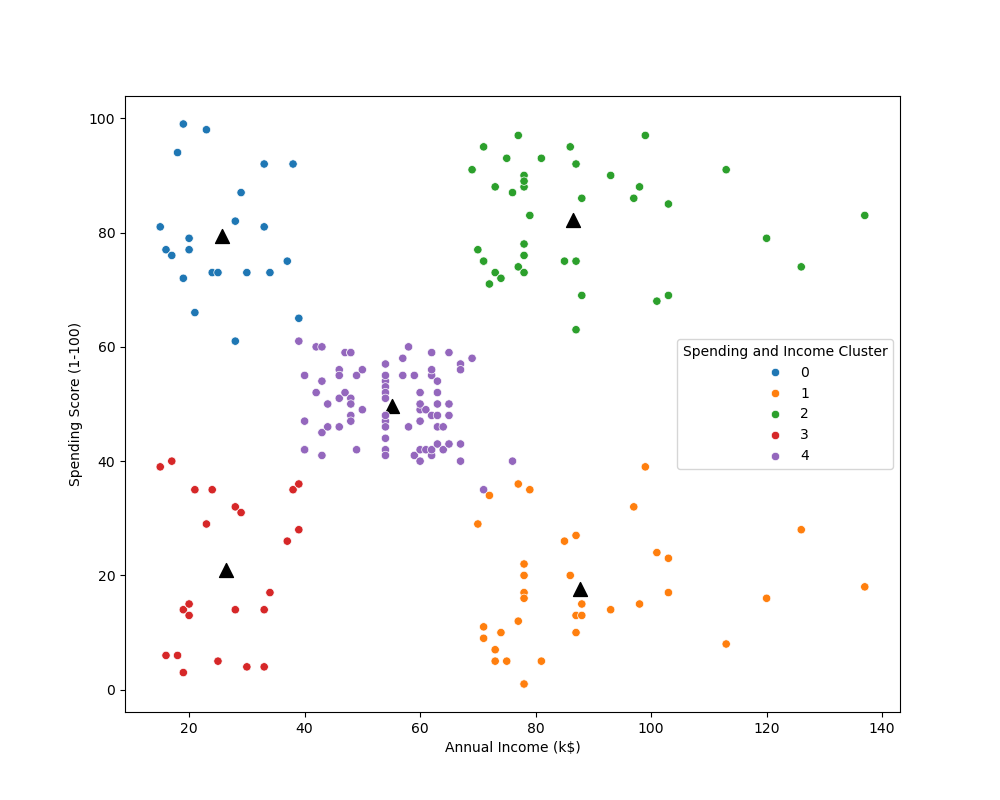

# Customer Segmentation Project

This project applies clustering techniques to segment mall customers based on spending patterns and demographics.  
It uses Python, Jupyter Notebook, and common data science libraries.

## Repository Structure
```
notebooks/
    clustering_and_segmentation.ipynb  # Main analysis notebook
data/
    Mall_Customers.csv                 # Raw dataset
    Clustering.csv                     # Processed dataset
images/
    clustering_bivariate.png           # Visualization result
README.md
requirements.txt
.gitignore
```

## Preview


## How to Run
1. Clone this repo
2. Install dependencies:
   ```bash
   pip install -r requirements.txt
   ```
3. Open the notebook:
   ```bash
   jupyter notebook notebooks/clustering_and_segmentation.ipynb
   ```

## Requirements
See [requirements.txt](requirements.txt) for details.
